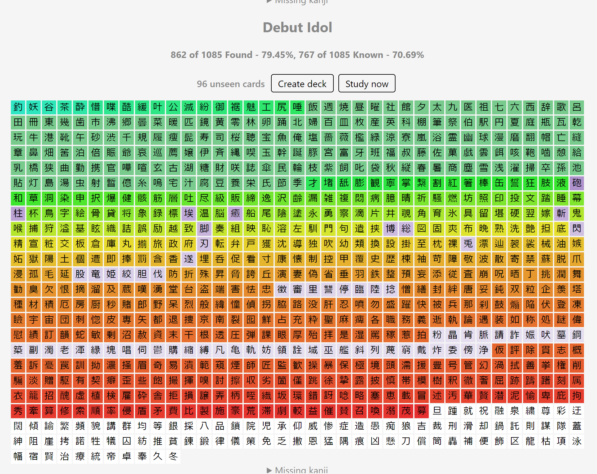
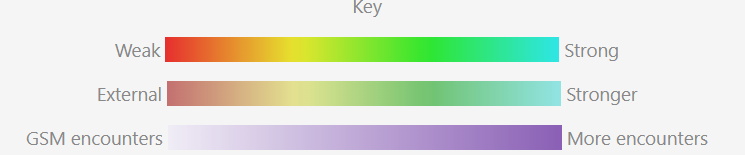
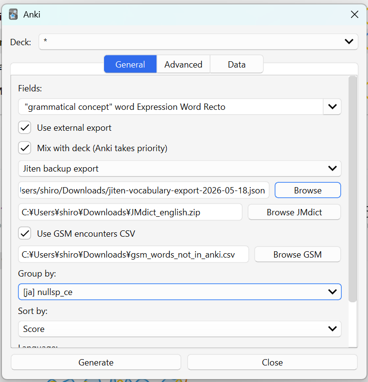
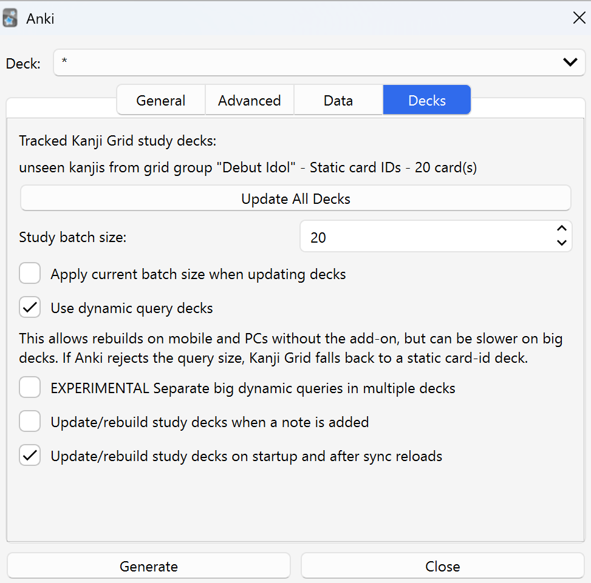

# Kanji Grid External Sources Fork

This is a personal fork of [Kanji Grid Kuuube](https://github.com/Kuuuube/kanjigrid), which is itself an improved version of the older Kanji Grid add-on for Anki.

The goal of this fork is to allow including external sources of known data that are not in anki for any reason, mainly for having been acquired without the need of mining. 





## Warning

This fork is vibe-coded.


For general Kanji Grid usage, read the original project documentation:

- [Kanji Grid Kuuube](https://github.com/Kuuuube/kanjigrid)


## Installation


1. Download the latest release archive from this repository.
2. Open Anki.
3. Go to `Tools` > `Add-ons`.
4. Click `Install from file...`.
5. Select the downloaded add-on archive.
6. Restart Anki.

The fork uses its own non-AnkiWeb package name, so Anki's built-in add-on updater will not replace it with the original AnkiWeb add-on. If you previously installed a zip that used the original numeric package id, remove that old add-on entry before installing a fresh release from this repository.

## Basic Usage

1. Open Anki.
2. Go to `Tools` > `Kanji Grid` > `Create / Configure Grid...`.
3. Choose your normal deck and fields as you would in the original add-on.
4. Optionally enable one or more external sources in the setup window.
5. Click `Generate`.

Anki always has priority. If a kanji is already present in the selected Anki cards, the tile keeps the normal Anki-based color. External sources only fill in kanji that are missing from the Anki-derived grid.

The `Data` tab has a `Save selection` checkbox, enabled by default. When enabled, the add-on remembers the selected deck, fields, grouping, and language so study decks can be updated later without reopening the setup window.

The `Tools` > `Kanji Grid` menu also has shortcuts to regenerate the last saved grid without opening the setup window, update tracked study decks directly, and open the latest GitHub release page.

## External Sources

### Plain TXT Export

Use this for a simple word list, with one word per line.

Enable:

- `Use external export`
- `Plain TXT export`

Then select the `.txt` file.

These kanji use the same gradient family as Anki, but with a muted/desaturated look because no real review interval is available. The score is based on how many words **From the file** contain the kanji.

### Jiten Backup Export

Use this for a Jiten vocabulary backup JSON.

Enable:

- `Use external export`
- `Jiten backup export`

Then select:

- the Jiten vocabulary backup `.json`
- a JMdict/Yomitan ZIP, such as `JMdict_english.zip`

Jiten backups store word IDs instead of the written words. When using a backup JSON file, this fork resolves those IDs through the JMdict/Yomitan ZIP, then uses Jiten's scheduling interval data when available. Jiten-derived kanji use the same gradient family as Anki, but muted/desaturated to show that the data came from outside Anki.

The setup window also has a `Use Jiten API` option and a password-style `Jiten API key or Bearer token` field. When enabled, the add-on downloads enriched card data from Jiten during grid generation instead of asking for a backup JSON file or JMdict ZIP. The credential is saved in the add-on configuration so it persists between sessions.

The add-on creates a local cache for the JMdict ID mapping in:

```text
user_files/jmdict_sequence_cache.json
```

### GSM API / Encounters CSV

Use this for GameSentenceMiner encounter data.

If GSM is running locally, the add-on detects its API at:

```text
http://localhost:7275
```

When detected, enable:

- `Use GSM API`

The add-on reads GSM's own kanji grid endpoint and uses its encounter frequencies directly.

If GSM is not running, or if you prefer a file-based workflow, use the CSV fallback:

- `Use GSM encounters CSV fallback`

Then select the GSM `.csv` file.

GSM-derived kanji use a separate purple/gray encounter gradient. This is intentionally different from the Anki/Jiten colors because GSM represents exposure frequency, not memory strength or review interval.

## Using Multiple Sources Together

You can use all three layers at the same time:

1. Anki deck and fields
2. Jiten backup export
3. GSM API or encounters CSV

Priority order:

1. Anki
2. Jiten / TXT external export
3. GSM encounters

That means Anki colors are never overwritten by external sources. Jiten/TXT can fill missing kanji after Anki. GSM can then fill anything still missing.

## Group Study Decks

When a grouping is selected, each group block can expose study actions for kanji that are present in Anki but still unseen.

- `Create deck` creates or updates a persistent filtered deck for that group, refreshes Anki's deck list, and keeps the Kanji Grid popup open.
- `Study now` creates or updates the same persistent deck if it already exists, otherwise it follows the temporary-study behavior controlled by the add-on config.
- Persistent study decks are named `unseen kanjis from grid group "Group Name"`.
- Temporary study decks are named `Temp - unseen kanjis from grid group "Group Name"` and are cleaned up when temporary study mode is enabled.

[!NOTE] There is no guarantee the decks only contain cards that exatly match the group you selected, TMW Quiz, JLPT Levels etc.. It fetches ALL WORDS that contain the kanjis listed in these groups. 

The `Decks` tab lists tracked Kanji Grid study decks and includes `Update All Decks`.

`Update All Decks` handles both study-deck modes:

- Dynamic query decks keep their existing filtered-deck search and are rebuilt
- Static card-id decks are recalculated from the setup that was saved when each study deck was created.

The `Study batch size` setting controls the filtered deck's `Limit to` value when it is created. The default is `10`.

`Make Study Now decks temporary` makes `Study now` open a temporary filtered deck instead of creating a persistent study deck.

When pressing `Update All Decks`: 
 - Cards that are in "learning" are returned to their original deck with the learning state preserved (anki default behavior).
 - if `Apply current batch size when updating decks` is toggled, changes the decks ­`limit to` value to the global one. this exists so that user set limits can be kept.
 - the deck is rebuilt, with as many notes as the matching data and `limit to` allow.
 

When a group study deck is created, Kanji Grid saves the relevant deck, field, grouping, language, search, and study-deck mode settings for that deck in `user_files/study_deck_configs.json`. Later updates use that saved snapshot, so changing the popup's current grouping or deck selection does not silently change older study decks. Orphaned entries are cleaned when study deck updates run.

`Use dynamic query deck`: generates a query that uses anki native filtering to find matching words. This means newly mined cards matching the same group can be picked up by rebuilding the filtered deck. Dynamic decks can be rebuilt on mobile and on PCs without this add-on, but are heavier and slower when a group produces a very long kanji query. If Anki rejects a dynamic query because it is too large or invalid, the add-on falls back to a static precalculated card-id deck.

If disabled, the query would be is a pre calculated list of cards. Static card-id decks are faster but they need this add-on to recalculate the card list when your collection changes.

There is also an experimental `Separate big dynamic queries in multiple decks` option. When enabled, oversized dynamic queries are split into several filtered decks named with `1/X`, `2/X`, and so on. `Update All Decks` tracks and rebuilds those split decks using their saved creation setup.

The `Decks` tab also has optional settings to update or rebuild study decks when a note is added, and when Anki loads or reloads the collection. The startup/sync reload option is enabled by default, while the note-add option is disabled by default because rebuilding dynamic decks can take time.


The startup/sync behavior is controlled by `Update/rebuild study decks on startup and after sync reloads`.


These behaviors can be configured from the add-on config JSON:

```json
{
  "makestudydecktemporary": true,
  "usequerystudydeck": true,
  "splitbigdynamicqueries": false,
  "studydeckbatchsize": 10,
  "updatestudydeckbatchsize": false,
  "updatestudydecksonstartup": true,
  "rebuildstudydecksonnoteadd": false
}
```


## Upstream Documentation

This README only documents the fork-specific workflow. For everything else, use the original project:

- Usage and settings: [Kanji Grid Kuuube README](https://github.com/Kuuuube/kanjigrid)
- Grouping data format: [upstream grouping docs](https://github.com/Kuuuube/kanjigrid/blob/master/docs/grouping_data_format.md)
- Original issue tracker: [upstream issues](https://github.com/Kuuuube/kanjigrid/issues)

Please do not report bugs from this fork to the upstream project unless you have reproduced them in the unmodified upstream add-on.



